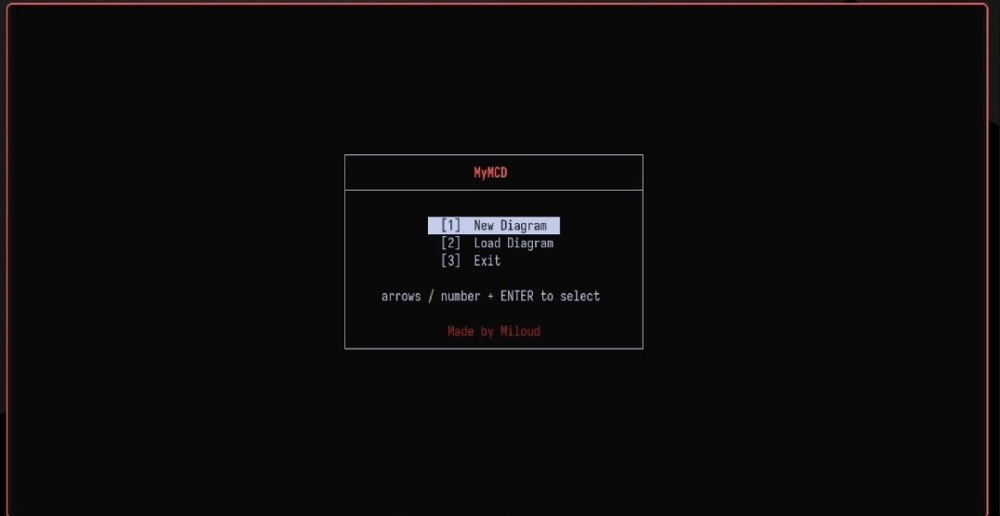

# MyMCD

A terminal-based MCD (Modelle Conceptuelle des Donnes) designer. Model your database schema as entities and relationships, then convert to MLD (Logical Data Model) and export SQL. Built with ncurses for a lightweight, keyboard-driven workflow Vim inspired.

Tired of using the mouse when creating your diagrams ? just type comands you get a production ready diagram.

**Status: Beta** – This is a hobby project I have been working on for around 5 months. It is functional and I use it regularly, but there are rough edges. Feedback and contributions are welcome.

---

## What it does

MyMCD lets you draw Entity-Relationship diagrams directly in your terminal. You create entities, link them with relationships, set cardinalities, and add properties. Once your MCD is ready, you convert it to an MLD where foreign keys are automatically migrated and junction tables are created for N:M relationships. From there you can export clean SQL with proper CREATE TABLE and ALTER TABLE FOREIGN KEY statements.

The whole thing runs in a TUI (terminal user interface) with color-coded elements, A* pathfinding for relationship lines that route around boxes, and a built-in searchable help system.


### Demo



---

## Features

### Modeling
- **Create entities** with typed properties (int, str, double, date, money)
- **Primary key** support with visual underline/bold rendering
- **Relationships** between any two entities (including reflexive / self-referencing)
- **Cardinality** support: 1:1, 1:N, N:M with automatic junction table creation
- **Properties on relationships** (e.g. a "grade" on a Student-Course enrollment)

### Conversion & Export
- **MCD to MLD conversion** – one command triggers the full migration:
  - N:M relationships become junction entities
  - 1:N relationships migrate the "1" side's primary key as a foreign key
  - 1:1 relationships resolve based on mandatory participation
  - Name clashes are auto-resolved with prefixed column names
- **SQL export** – generates standard SQL with:
  - CREATE TABLE for all entities
  - Composite primary keys for junction tables
  - ALTER TABLE ... ADD CONSTRAINT FOREIGN KEY (no forward-reference issues)

### Terminal UI
- **A* pathfinding** for relationship lines that automatically route around entities and other relationships
- **Smart attachment points** – multiple relationships on the same entity side get evenly spaced slots so lines do not overlap
- **Color coding** – entities, relationships, selected items, and connection paths each have distinct colors
- **Edit mode** – TAB to enter move mode, then `e` for entities or `r` for relationships, arrow keys to reposition
- **Built-in help** – type `help` for a searchable manual with examples, hotkeys, and command syntax
- **KMP search** inside the help window with `n`/`N` to jump between matches
- **Startup menu** – choose New Diagram, Load existing, or Exit

### File I/O
- **Save diagrams** as semicolon-delimited command scripts (human-readable, version-control friendly)
- **Load diagrams** by replaying the saved command script through the parser
- **Override protection** – warns before overwriting an existing file

### Technical internals
- Custom **arena allocator** with OS-specific page allocation (mmap on Linux, VirtualAlloc on Windows)
- Temporary arena for scratch memory (parser tokens, search results)
- Custom **lexer and tokenizer** with position tracking for error reporting
- **Abstract Syntax Tree** records every executed command for debugging and history
- **Binary heap priority queue** for the A* open set
- **KMP string search** for the help system
- Cross-platform: Linux, macOS, and Windows (via MinGW/MSYS2)

---

## Building

### Requirements
- GCC or Clang
- ncurses development libraries
- GNU Make

**Linux (Debian/Ubuntu):**
```bash
sudo apt-get install build-essential libncurses5-dev
```

**macOS:**
```bash
brew install ncurses
```

**Windows (MSYS2/MinGW-w64):**
```bash
pacman -S mingw-w64-x86_64-gcc mingw-w64-x86_64-ncurses make
```

### Compile
```bash
make
```

This produces the `MyMCD` binary in the project root.

### Run locally (all platforms)
```bash
make run
```

### Install system-wide (Linux/macOS only)
```bash
sudo make install        # installs to /usr/local/bin/MyMCD
make install PREFIX=~/.local   # install to user directory, no sudo needed
```

After installation, run from anywhere:
```bash
MyMCD
```

### Uninstall
```bash
sudo make uninstall
```

---

## Quick start

1. Run `./MyMCD` (or `make run`)
2. At the startup menu, pick **New Diagram** (or **Load** if you have a saved file)
3. Type commands in the console at the bottom:
   ```
   create entity "Customer"
   create entity "Order"
   create relationship "Places" "Customer" "Order"
   add property "Customer" "cust_id" int pk
   add property "Order" "order_id" int pk
   add card "Places" "1,n,1,1"
   ```
4. Press **TAB** to enter edit mode, then **e** to move entities or **r** for relationships. Use arrow keys. Press **q** to quit move mode.
5. Type `convert MLD` to migrate to logical model
6. Type `save MLD "myschema.sql"` to export SQL

Type `help` anytime for the full command reference.

---

## Command reference

| Command | Description |
|---------|-------------|
| `create entity "Name"` | Create a new entity box |
| `create relationship "Name" "Entity1" "Entity2"` | Link two entities |
| `add property "Target" "prop_name" type [pk or fk]` | Add a property to entity or relationship |
| `add card "Relationship" "min,max,min,max"` | Set cardinality for both sides |
| `add card "Relationship" "Entity" "min,max"` | Set cardinality for one side |
| `change name "Old" "New"` | Rename an entity or relationship |
| `delete "Name"` | Remove an entity (and its attached relationships) or a relationship |
| `convert MLD` | Convert MCD to logical model |
| `save MCD "file.txt"` | Save current MCD diagram |
| `save MLD "file.txt"` | Save current MLD diagram |
| `save SQL "file.sql"` | Export SQL (only after MLD conversion) |
| `clear` | Clear the entire diagram |
| `help` | Open the help window |
| `exit` or `quit` | Quit the application |

Property types: `int`, `str`, `double`, `date`, `money`

Key markers: `pk` (primary key), `fk` (foreign key – only allowed in MLD mode)

---

## Keyboard shortcuts

| Key | Action |
|-----|--------|
| `Tab` | Enter edit mode |
| `e` | Move entities (in edit mode) |
| `r` | Move relationships (in edit mode) |
| `Tab` (again) | Cycle selection in move mode |
| `q` | Quit current mode / close help |
| `x` | Exit edit mode, return to typing |
| `j` / `k` | Scroll help up/down |
| `/` | Search in help |
| `n` / `N` | Next/previous search match |
| `Arrow keys` | Move selected item (in move mode) |
| `Up` / `Down` | Command history |

---

## Testing

The project includes a comprehensive test suite covering the arena allocator, lexer, parser, MCD elements, help/KMP search, and integration workflows.

Run all headless tests:
```bash
make test_all
```

Run individual suites:
```bash
make test_arena       # Arena allocator (no ncurses)
make test_lexer       # Tokenizer (no ncurses)
make test_parser      # Parser + command execution
make test_mcd         # MCD element API
make test_help        # Help window + KMP search
make test_integration # End-to-end workflows
make test_graphics    # Visual ncurses tests (interactive)
```

Test results are written to `*_test_results.log` files.

---

## Project structure

```
.
├── src/
│   ├── main.c                  # Entry point, main input loop
│   ├── MCD_elements.c/h        # Entity, Relationship, Property structs and API
│   ├── graphics.c/h            # ncurses rendering, A* pathfinding, console/help windows
│   ├── global_objects.c/h      # Global entity/relationship registry
│   ├── command_processor.c/h   # Command execution dispatcher
│   ├── help_window.c/h         # Built-in help pages and scrolling
│   ├── Lexer/
│   │   ├── tokenize.c/h        # Lexer (keywords, strings, identifiers)
│   │   └── parse.c/h           # Parser + command executors
│   ├── DSA/
│   │   ├── AST.c/h             # Abstract Syntax Tree for command history
│   │   ├── astar.c/h           # A* pathfinding grid
│   │   ├── pqueue.c/h          # Binary heap priority queue
│   │   ├── kmp.c/h             # KMP string search
│   │   └── vec.c/h             # Generic dynamic array (stretchy buffer)
│   └── utils/
│       ├── arena_allocator.c/h # Cross-platform arena allocator
│       ├── save.c/h            # Save/load diagram files
│       ├── sql.c/h             # SQL generation
│       └── menu.c/h            # Startup menu
├── src/testing/
│   └── tests.c                 # Comprehensive test suite
├── Makefile
└── README.md
```

---

## Known limitations

This is beta software. Here is what you should know:

- **Name length limit**: 14 characters for entity, relationship, and property names
- **Property cap**: 20 properties max per entity or relationship
- **Object cap**: 100 total entities and relationships
- **One-way conversion**: MCD to MLD conversion cannot be undone. Save your MCD before converting.
- **Terminal only**: No GUI version. Requires a terminal with ncurses and color support.
- **Resize handling**: Terminal resizing is basic. If the layout breaks, restart the application.
- **Wayland flicker**: Some rendering optimizations are Wayland-specific; X11 and Windows terminals may have minor flicker during rapid redraws.
- **Windows install**: `make install` is disabled on Windows. Use `make run` instead.
- **Save format**: Diagrams are saved as plain text command scripts, not binary files. This is intentional for version control, but there is no schema validation on load.
- **Foreign keys**: Adding `fk` properties is rejected in MCD mode. Convert to MLD first.
- **No undo**: There is no undo command yet. `clear` wipes everything without confirmation.

---

## Why I built this

I started MyMCD because I wanted a fast, lightweight tool for sketching database schemas without leaving the terminal (where i spend most of my time) and without my hands leaving my keyboard. Existing tools were either too heavy, required a browser, Old,  or did not support the Merise methodology (MCD/MLD) that I learned in school. Five months of evenings and weekends later, here it is. It is not perfect, but it does exactly what I need, and I hope it helps someone else too.

---

## License

MIT License – do whatever you want with it. Attribution is appreciated but not required.

---

## Contributing

This is a personal hobby project, but I am happy to review pull requests. Areas that could use help:
- Better terminal resize handling
- A proper undo/redo system
- GUI version (GTK/Qt) or web export
- More comprehensive error messages for parser failures
- Windows native build without MSYS2

If you find a bug, please open an issue with the command that triggered it and your terminal environment (OS, terminal emulator, TERM value).
